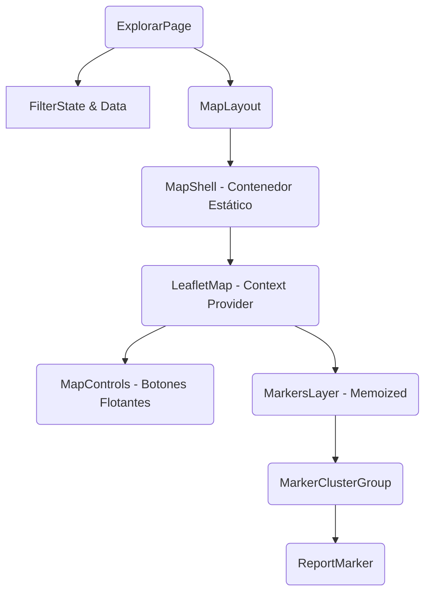

# Guía de Implementación: Mapa Interactivo Profesional (SafeSpot)

> **Propietario:** Senior Frontend/UX Engineer
> **Objetivo:** Mapa interactivo de alto rendimiento, UX fluida y lista para producción.

---

## 1. Arquitectura del Mapa

El mapa no es un componente monolítico. Se divide en responsabilidades claras para evitar re-renders masivos.

### Diagrama de Componentes


### Gestión de Estado
*   **Fuera del Mapa (Global/Page):** `filters`, `reports`, `isLoading`.
*   **Dentro del Mapa (Local):** `viewport` (bounds/zoom), `selectedMarkerId`, `isFollowMode`.

**Regla de Oro:** El movimiento del mapa NO debe re-renderizar la página entera.

---

## 2. UX FIRST (Prioridad Absoluta)

El mapa debe sentirse "vivo" antes de cargar datos.

### Estados de Carga
1.  **Montaje Inicial:** Mostrar `MapSkeleton` (un div gris con patrón de grilla sutil + placeholder de controles). **NUNCA** pantalla blanca.
2.  **Cargando Datos:** Spinner sutil en esquina superior derecha dentro del mapa. El mapa sigue siendo interactivo.
3.  **Sin Reportes:** Mostrar alerta flotante: *"No hay reportes en esta zona con los filtros actuales."* + Botón "Limpiar filtros".
4.  **Error:** Toast no intrusivo + Botón reintentar discreto.
5.  **Permisos:** Si niega geo, default a centro de la ciudad configurada. Toast: *"Ubicación desactivada, mostrando centro predeterminado."*

---

## 3. Marcadores Profesionales

### Sistema Visual
*   **Categoría:** Color semántico (Rojo=Robo, Naranja=Asalto, Azul=Objeto perdido).
*   **Iconografía:** Lucide React icons estandarizados.
*   **Estado:**
    *   *Default:* Opacidad 1, escala 1.
    *   *Hover:* Escala 1.1, z-index superior.
    *   *Seleccionado:* Borde blanco grueso, escala 1.2, pulso CSS.

### Helper de Iconos (`src/lib/map-utils.tsx`)
```tsx
import { divIcon } from 'leaflet'
import { renderToString } from 'react-dom/server'
import { AlertTriangle, Bike, Car, Package } from 'lucide-react'

export const getMarkerIcon = ({ category, status, isSelected }) => {
  const colorClass = getCategoryColor(category) // 'bg-red-500'
  const IconComponent = getCategoryIcon(category) // <Bike />
  
  const html = renderToString(
    <div class={`
      marker-pin ${colorClass} 
      ${isSelected ? 'marker-selected ring-2 ring-white scale-110' : ''}
      ${status === 'resuelto' ? 'opacity-60 grayscale-[0.5]' : ''}
      flex items-center justify-center rounded-full w-8 h-8 shadow-lg transition-transform
    `}>
      <IconComponent class="text-white w-5 h-5" />
    </div>
  )

  return divIcon({
    html,
    className: 'custom-marker-container',
    iconSize: [32, 32],
    iconAnchor: [16, 32],
    popupAnchor: [0, -32]
  })
}
```

---

## 4. Clustering Inteligente (Performance Real)

### Librería Elegida: `react-leaflet-cluster`
*   **Por qué:** Wrapper oficial compatible con React 18 que maneja el ciclo de vida de `leaflet.markercluster` eficientemente.
*   **Estrategia:**
    *   *Zoom < 14:* Clusterizar agresivamente.
    *   *Zoom > 15:* Desactivar clustering (Spiderfy) para ver detalles precisos.

---

## 5. Interacciones Clave

1.  **Click en Marcador:** Abre `Popup` nativo de Leaflet pero con contenido React (`<NanoCard />`).
2.  **Click en Popup:** `navigate('/reporte/' + id)`.
3.  **Hover en Lista:** `map.flyTo(coords, 16)` (suave).
4.  **Botón "Buscar en esta zona":** 
    *   Al hacer `dragend`, mostrar botón flotante si el centro se movió > 500m.
    *   Click → Refetch con nuevos bounds (o filtrar localmente si es client-side).
    *   **NO auto-fetch:** UX terrible que consume API innecesariamente.

---

## 6. Percepción de Velocidad

### Estructura de Render
```tsx
<div className="relative h-[600px] w-full bg-slate-100 rounded-xl overflow-hidden">
  {/* 1. Shell visible inmediato */}
  <MapContainer center={center} zoom={13} className="h-full w-full">
    <TileLayer url="https://{s}.basemaps.cartocdn.com/light_all/{z}/{x}/{y}{r}.png" />
    
    {/* 2. Markers cargan async sin bloquear UI */}
    <MarkersLayer reports={reports} />
    
    {/* 3. Controles siempre encima */}
    <MapControls />
  </MapContainer>
  
  {/* 4. Feedback estados sobre el mapa */}
  {isLoading && <LoadingOverlay />}
  {error && <ErrorOverlay />}
  {showSearchThisArea && <SearchHereButton />}
</div>
```

---

## 7. Integración con Filtros Globales

El mapa es un "consumidor" de filtros, no el dueño.
`ExplorarPage` tiene el state `filters`. El mapa recibe `reports` ya filtrados.
**Sincronización:** Si el usuario filtra por "Robos" en el header, los marcadores del mapa se actualizan automáticamente (React reactivity).

---

## 8. Código Mínimo Esencial (Implementación)

### `src/components/map/SafeSpotMap.tsx`
```tsx
import { MapContainer, TileLayer, Marker, Popup, useMap } from 'react-leaflet'
import MarkerClusterGroup from 'react-leaflet-cluster'
import { getMarkerIcon } from '@/lib/map-utils'

const RecenterButton = () => {
  const map = useMap()
  const onClick = () => navigator.geolocation.getCurrentPosition(
    pos => map.flyTo([pos.coords.latitude, pos.coords.longitude], 15)
  )
  return <Button className="leaflet-control-custom" onClick={onClick}>Centrar</Button>
}

export function SafeSpotMap({ reports }) {
  return (
    <MapContainer center={[-34.6037, -58.3816]} zoom={13} className="h-full z-0">
      <TileLayer url="https://{s}.basemaps.cartocdn.com/rastertiles/voyager/{z}/{x}/{y}@2x.png" />
      
      <MarkerClusterGroup chunkedLoading>
        {reports.map(report => (
          <Marker 
            key={report.id} 
            position={[report.latitude, report.longitude]}
            icon={getMarkerIcon({ category: report.category, status: report.status })}
          >
            <Popup>
              <div className="min-w-[200px]">
                <h4 className="font-bold">{report.title}</h4>
                <p className="text-xs text-muted-foreground">{report.category}</p>
                <a href={`/reporte/${report.id}`} className="text-neon-green text-sm font-semibold block mt-2">
                  Ver Detalles →
                </a>
              </div>
            </Popup>
          </Marker>
        ))}
      </MarkerClusterGroup>
      
      <div className="absolute top-4 right-4 z-[400]">
        <RecenterButton />
      </div>
    </MapContainer>
  )
}
```

---

## 9. Errores a Evitar (Anti-patterns)

*   ❌ **Auto-fit bounds en cada render:** El mapa "salta" cada vez que se filtra algo. Solo hacer fitBounds inicial o manual.
*   ❌ **Markers estáticos pesados:** Usar SVGs complexes en el DOM. Usar `divIcon` ligero o `canvas` si son miles.
*   ❌ **Popups complejos:** No renderizar componentes pesados dentro de Popups ocultos.
*   ❌ **Scroll trap:** El mapa captura el scroll de la página. Usar `scrollWheelZoom={false}` o requerir Ctrl+Scroll.

---

## 10. Resultado Final Esperado

### Checklist de "Mapa Listo"
- [ ] Carga en < 100ms (Shell).
- [ ] No bloquea el scroll de la página.
- [ ] Marcadores distinguidos por categoría.
- [ ] Clusters fonctionnent suaves.
- [ ] Click en marker abre popup informativo.
- [ ] Botón "Centrar en mí" funciona.
- [ ] Responsive (altura ajustada en móvil).

### Fase Futura
- **Server-Side Bounds:** API endpoint que recibe bbox.
- **Heatmaps:** Capa de calor para zonas peligrosas.
- **Rutas:** Dibujar recorrido del incidente.
