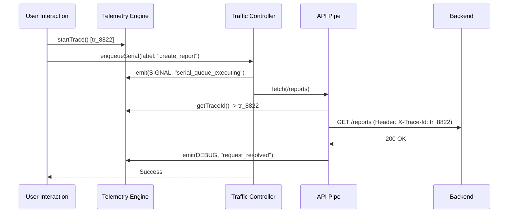

# Motor 8: Unified Telemetry Engine — Diseño de Arquitectura

## 1. Identidad de Instancia (`instanceId`)
*   **Generación**: UUID generado al cargar el script de telemetría por primera vez.
*   **Persistencia**: `sessionStorage` para mantener la misma identidad si el usuario refresca la pestaña.
*   **Propósito**: Diferenciar trazas de pestañas paralelas que comparten el mismo `anonymousId`.

## 2. Telemetry Envelope
Estructura unificada para todos los eventos del motor:

```typescript
interface TelemetryEnvelope {
  traceId: string;        // Identificador de la cadena completa
  spanId: string;         // Identificador de la operación actual
  instanceId: string;     // Identificador de la pestaña
  engine: string;         // Nombre del motor (Bootstrap, Traffic, SSE, etc.)
  engineState: string;    // Snapshot del estado actual del motor
  severity: Severity;     // DEBUG, INFO, SIGNAL, WARN, ERROR
  timestamp: number;      // High-resolution timestamp
  payload: any;           // Datos específicos del evento
}
```

## 3. Propagation Model (Causality)
El Motor 8 utiliza un modelo de **Suscripción y Propagación Explicativa**:

### A. Trace Context Manager
Un gestor central que mantiene el `traceId` actual. Dado que el frontend es asíncrono y carece de `ThreadLocal`, usaremos:
*   **Manual Inheritance**: Las funciones asíncronas pueden recibir un `traceId` opcional.
*   **Context Scoping**: Un wrapper para ejecutar callbacks dentro de un contexto de traza específico.

### B. Headers de Red
Todas las peticiones a la API incluirán:
*   `X-Trace-Id`: El `traceId` actual.
*   `X-Instance-Id`: El `instanceId` de la pestaña.

## 4. Global Signal Hub
Un recolector pasivo que actúa como un bus de eventos de diagnóstico.
*   **Ingestión**: Recibe `TelemetryEnvelope`.
*   **Procesamiento**: Calcula deltas de tiempo entre spans relacionados.
*   **Salida**: Logs enriquecidos en consola y (opcionalmente) persistencia efímera para debugging post-mortem.

---
## 5. Trace Flow Diagram



## 6. Checklist de Validación (No-Regresión)
- [x] **Comportamiento Visual**: Sin cambios en loaders ni componentes.
- [x] **Performance**: Sin impacto perceptible en el Main Thread (métrica de 100ms).
- [x] **Red**: Sin llamadas HTTP adicionales (solo inyección de headers).
- [x] **Persistencia de Instancia**: `instanceId` sobrevive a F5 (en sessionStorage).
- [x] **Linaje SSE**: Los eventos de `Orchestrator` inician trazas raíz.

---
**Veredicto de Implementación**: Motor 8 operativo y correlacionando señales.
